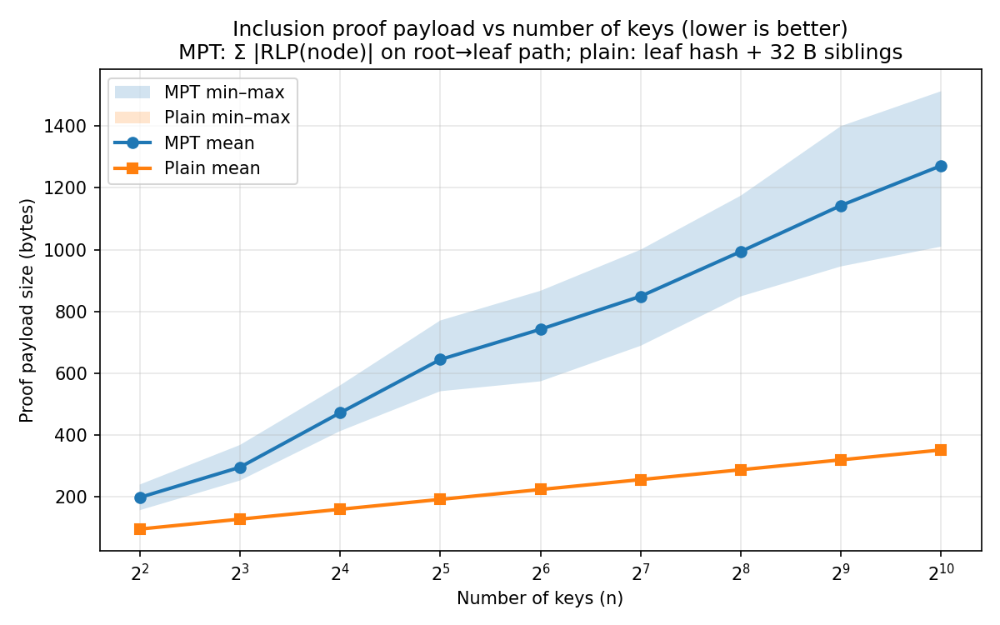
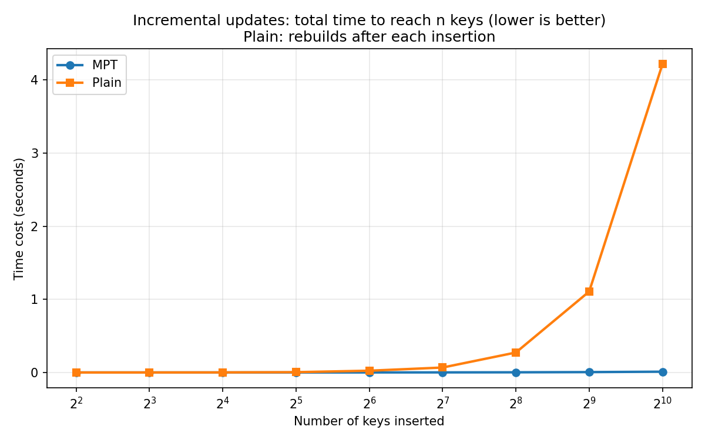
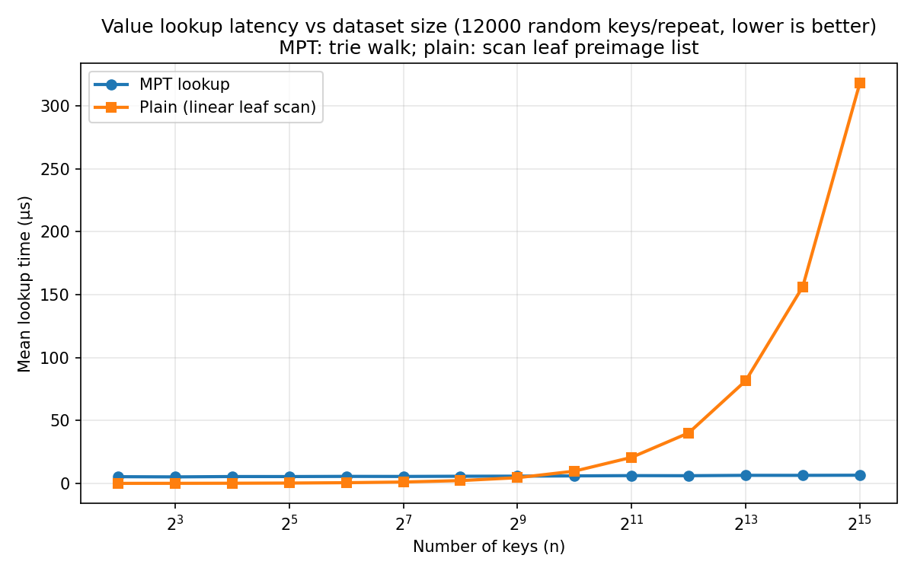

# Merkle Patricia Trie (Ethereum-style)

Educational implementation of an Ethereum-rule hexary Merkle Patricia Trie (RLP + Keccak-256, hashed keys), with:
- **Inclusion proofs** and a **step-by-step verification trace** (for the web demo)
- **Visualization** (Graphviz / JSON graph)
- **Pluggable persistence** via a simple KV interface (e.g. in-memory, SQLite, RocksDB via `rocksdict`)

You can access the online demo [here](https://mpt-demo.onrender.com/).

## Run Web Demo on Your Computer (Svelte + FastAPI)

### Option 1: Dev (two processes)

```bash
python3 -m pip install -e ".[web]"
python3 -m uvicorn api_server:app --reload --host 127.0.0.1 --port 8000
```

```bash
cd web
npm install
npm run dev
```

Open `http://localhost:5173` (Vite proxies `/api/*` → `127.0.0.1:8000`).

### Option 2: Single server (serve `web/dist` from FastAPI)

```bash
python3 -m pip install -e ".[web]"
cd web && npm ci && npm run build
cd .. && python3 -m uvicorn api_server:app --host 127.0.0.1 --port 8000
```

Open `http://127.0.0.1:8000`.

### Option 3: Deploy (Render blueprint)

This repo includes `render.yaml`. The hosted demo sets `MPT_PUBLIC_DEMO=true` to disable loading on-disk DBs under `./db`.

## Benchmarks (MPT vs plain binary Merkle tree)

Install plotting deps once:

```bash
python3 -m pip install -e ".[dev]"
```

### Proof payload size

```bash
python benchmark/plot_proof_size_curves.py --output [png_path]
```

Optional flags:
- `benchmark/plot_proof_size_curves.py`: `--n-min [keys]`, `--n-max [keys]`, `--n-values [comma_separated_keys]`, `--seed [seed]`, `--output [png_path]`



### Incremental inserts

```bash
python benchmark/plot_incremental_updates.py --output [png_path]
```

Optional flags:
- `benchmark/plot_incremental_updates.py`: `--n-min [keys]`, `--n-max [keys]`, `--n-values [comma_separated_keys]`, `--seed [seed]`, `--repeats [repeats]`, `--output [png_path]`



### Lookup time

```bash
python benchmark/plot_lookup_time.py --output [png_path]
```

Optional flags:
- `benchmark/plot_lookup_time.py`: `--n-min [keys]`, `--n-max [keys]`, `--n-values [comma_separated_keys]`, `--seed [seed]`, `--lookup-seed [seed]`, `--num-lookups [count]`, `--repeats [repeats]`, `--output [png_path]`


